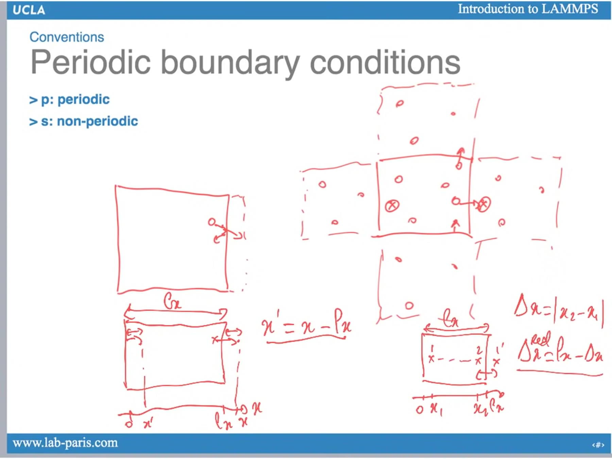
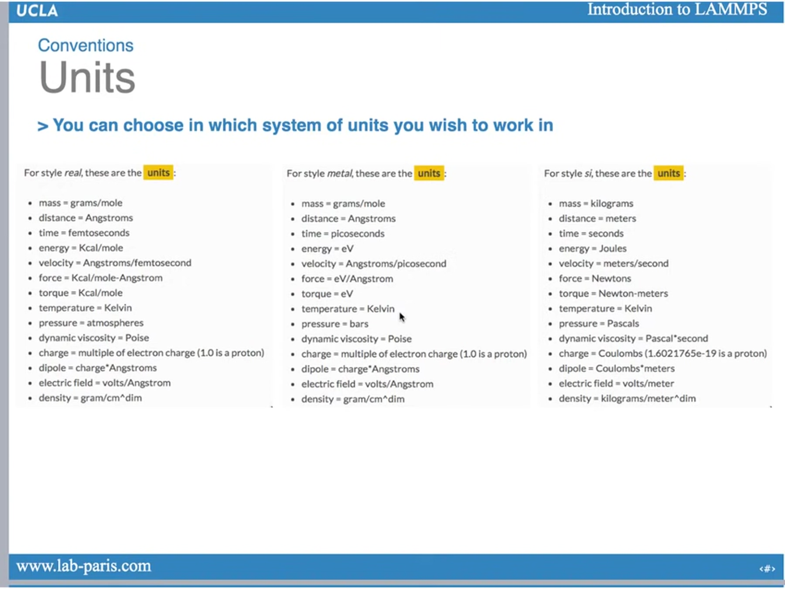

# Introduction to LAMMPS

- [Introduction to LAMMPS](#introduction-to-lammps)
  - [Brief intro](#brief-intro)
  - [Conventions of LAMMPS](#conventions-of-lammps)
    - [Cubic box](#cubic-box)
    - [Periodic boundary conditions](#periodic-boundary-conditions)
    - [Thermodynamic ensemble 热力学系综](#thermodynamic-ensemble-热力学系综)
    - [Units](#units)
  - [Input files](#input-files)
    - [File structure](#file-structure)
      - [Typical input files](#typical-input-files)
      - [Typical data files(\*.data)](#typical-data-filesdata)
      - [Typical input file (in.xxx)](#typical-input-file-inxxx)
      - [Typical potential file (pot.mod)](#typical-potential-file-potmod)
    - [List of typical output files](#list-of-typical-output-files)
      - [Typical trajectory file](#typical-trajectory-file)
  - [How to run](#how-to-run)

## Brief intro

- can run on serial, but when it comes to hundreds of atoms, mpi should be implemented for greater efficiency.

## Conventions of LAMMPS

*Credits to [PARISlab@UCLA](https://www.youtube.com/@paris_lab)*

### Cubic box

- For a cubix box, $$l_x=l_y=l_z=edgeofthebox$$ and $$xy=xz=yz=0$$

- $x_{lo},y_{lo},z_{lo}$ can always be chosen as being zero, so that:

$x_{lo}=0,x_{hi}=l_x=a,$
$y_{lo}=0,y_{hi}=l_y=a,$
$z_{lo}=0,z_{hi}=l_z=a,$

We use $(x,y，z)$ to express the location of each atom

### Periodic boundary conditions

    p:periodic; s:non-periodic

for periodic boundary, no atom can leave the box

It varies from different boundary types, non-periodic $\Delta x=|x_2-x_1|$；periodic boundary $\Delta ^{real}_{x}=l_x-\Delta x$

### Thermodynamic ensemble 热力学系综

- NVE: microcanonical ensemble
- NVT: canonical ensemble
- NPT: isobaric ensemble

| Abbreviation | Meaning         |
| :----------: | --------------- |
|      N       | Number of atoms |
|      V       | Volume          |
|      T       | Temperature     |
|      P       | Pressure        |
|      E       | Energy          |

| Extensive |    Intensive property    |
| --------- | :----------------------: |
| N         | $\mu$ chemical potential |
| V         |            P             |
| E         |            T             |

### Units

different *styles* leads to different unit sets

## Input files

### File structure

- Each new simulation run in a **new directory** to avoid overwrite crucial files between different runs.
- **Input files** containing simulation settings
- **Output files** of the simulation outcomes

#### Typical input files

1. structure.dat
   **data file:** contains the size of the system,the number of atoms, the number of atom types, the mass of each type, the position of each atom (and potentially their velocity)

2. in.filename
   **input file:** contains the instructions of the tasks to perform,the parameters (and potentially the force-field, or empirical potential). Can also contain the position of each atoms (when it can be calculated analytically, like for crystals)

3. pot.mod
   potential file (when necessary):contains information about the potential to use one of each row to be fixed at a time

#### Typical data files(*.data)

Contains all the info of number of atoms, types,geometry and initial position.

Typical syntax:
> #title of the system
>
> Number of atoms
> number of atom types
>
> geometry of the system (box)
> molar masses
>
> atoms #id type charge coordinates(x,y,z)

we could use other softwares to generate this file !!where to find?

#### Typical input file (in.xxx)

> **unit type**
> dimension 3
> processors \* \* \*
> boundary p p p (**p**eriodic)
>
> **read data**
> atom_style charge
> read_data *.dat
>
> **potential**
> include *.mod
>
> **outputs**
> thermo 100
> thermo_style keywords of output variables
> dump every 1000 steps, name of output file, id type coordinates
>
> **initial minimisation**
> minimize 1.0e-10 1.0e-10 10000 10000
> (energy minimization makes the distribution of atom more realistic)
>
> **initial mixing**
> fix 1 all ensemble init_t final_t dumping_factor
> run steps
> unfix 1
>
> **cooling at 1k/ps**
> ...
> **final relaxation**
> ...
> **final configuration**
> write_data *.dat
> write_restart \*.rest

#### Typical potential file (pot.mod)

> BKS potential
> coefficients of the bonds
> 库伦力截止距离，超过就认为没有相互作用？
> MD parameters
[convert from MS to lammps data](https://blog.sciencenet.cn/blog-3437453-1276040.html)

### List of typical output files

- final-structure.dat-data file:identical to the input data file, but contains the information about the final system. Can be used as a starting input data file for another simulation

- md.lammpstrj-trajectory file: positions of the atoms every N steps (for visualization of further analysis)

- log.lammps-log file:store all the actions performed by LAMMPS. Useful to look at when something goes WRONG (as it usually does)

- out.filename-output file:contains a summary of the action executed,the potential error messages, and the thermodynamics data

#### Typical trajectory file

> time step
num of atoms
box boundaries
> properties of all atoms

## How to run

> Imp_win_no-mpi-in in.filename-out out.filename(Windows)